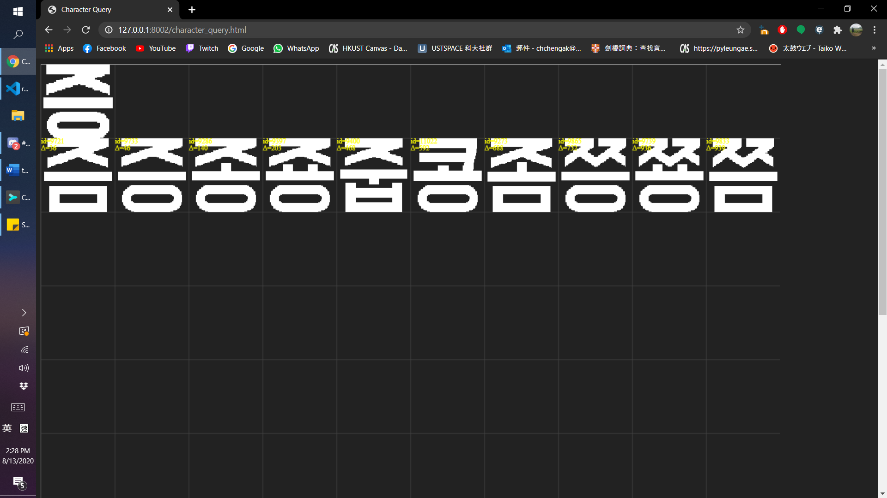
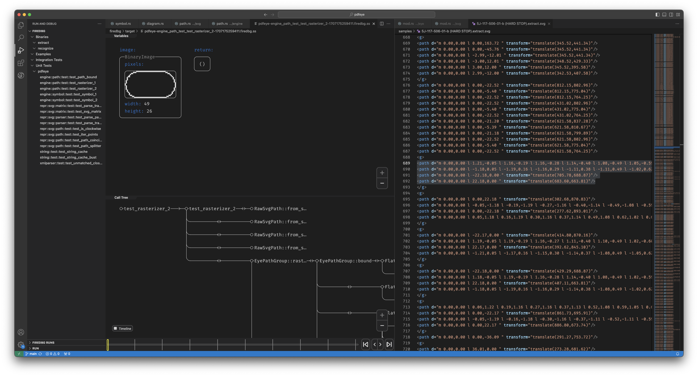
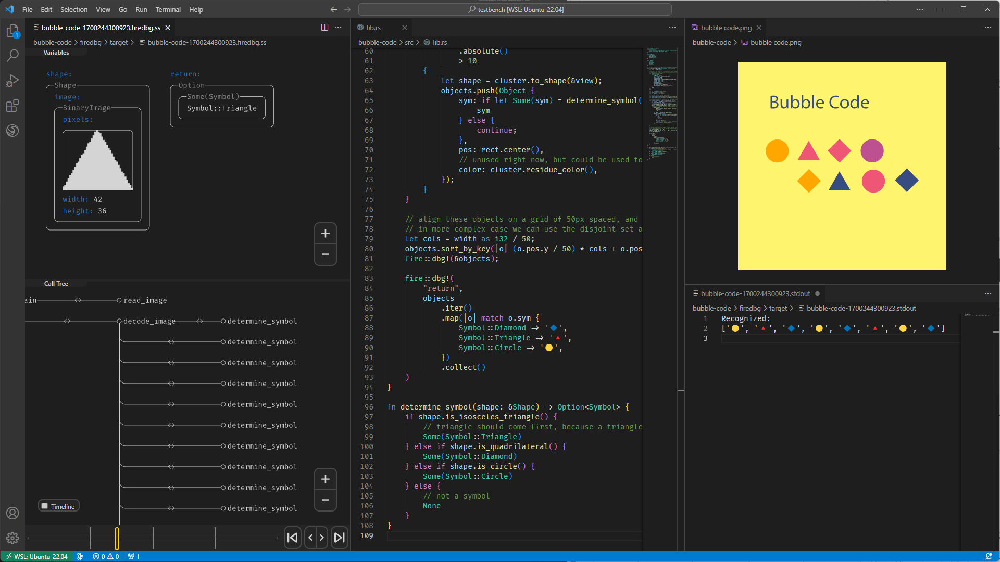

# Semantic Computer Vision

What is semantic computer vision? This fascinating field is the intersection of computer graphics / computer vision / computational geometry - to study man-made graphics, instead of photographs. Artificial graphics should not be treated as natural signals - the information we try to convey via graphics is intentional and so requires deliberate treatment.

For the technologies that we developed, they all share a common set of techniques and some of them were published in the `visioncortex` programming library. The principles are simple - recognition is information reduction as we move up to higher level of abstract representations. So the first step is always statistical - we perform statistical image segmentation and statistical shape analysis. The second step is usually quantization and constructing an abstract representation. Once we have that, the rest is just usual Software Engineering(tm). Umm... but Ambiguity Calculus is something we havn't properly done yet.

||
|-----|
|Optical character recognition of Korean characters.|

||
|-----|
|Rasterizing and recognizing elements of SVG documents.|

||
|-----|
|A 'simple' demo of symbol extraction and recognition. It would have been real-simple if the image is black-and-white, or the background color is known priori.|

||
|-----|
| |
|Recognizing arrow markers (highlighted in red) in engineering drawings. It would be simple if the graphic and markers don't overlap / intersect that much. But it can get messy.|
